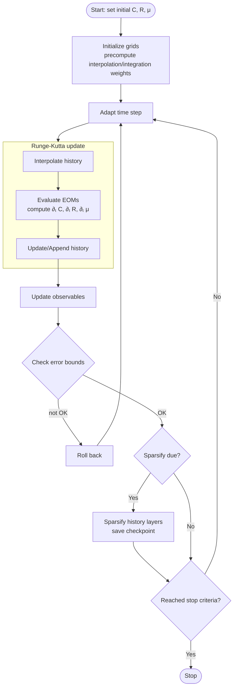

#  Algorithm (from Lang–Sachdev–Diehl, Phys. Rev. Lett. **135**, 247101 (2025))

This section summarizes the numerical renormalization algorithm implemented in DYNAMITE for solving non-stationary dynamical mean-field equations (DMFT) after a quench.

## Dynamical equations

We evolve correlation C(t,t') and response R(t,t') for t ≥ t'. The equations take the schematic form

$$
\partial_t C(t,t') = \mathcal{F}[C,R](t,t')\,,\qquad
\partial_t R(t,t') = \mathcal{G}[C,R](t,t')\,.
$$

For the spherical mixed p-spin model (representative), the functionals \(\mathcal{F},\mathcal{G}\) contain convolution-like memory integrals in both time arguments with kernels determined by the interaction orders and couplings. The renormalization scheme parses these integrals to achieve (sub)linear scaling in simulated time.

## Numerical renormalization: core idea

- Represent the 2D time plane on an adaptive sparse grid.
- Interleave time evolution with periodic sparsification to prune redundant history while preserving interpolation accuracy.
- Maintain a compressed representation of C and R enabling fast convolution-like updates via precomputed index/weight maps.

This reduces the asymptotic cost from \(\mathcal{O}(T^3)\) to linear in the total simulated time (see paper for precise exponents and regimes), enabling orders-of-magnitude longer runs.

Important: DYNAMITE uses exactly the non-equidistant grid defined in the Phys. Rev. Lett. article. The performance gains critically rely on this grid; substituting an equidistant grid drastically reduces the accessible times. See Interpolation grids for details.

## Discrete scheme and data layout

- Store fields on a sparse set of (t, t') nodes; the diagonal t=t' is tracked separately for observables.
- Precompute interpolation structures (positions, indices, weights) on a base grid of length L; these are used for fast 2D interpolation.
- History is organized in layers corresponding to renormalized time scales; layers can be coarsened as t grows while keeping error below a tolerance.

## Symbols in outputs

- `QKv`, `QRv`: grid samples of C and R
- `dQKv`, `dQRv`: their time derivatives
- `t1grid`: time nodes used by the integrator
- `rvec`, `drvec`: reduced observables along the diagonal

## Integrator and update cycle

Time stepping follows the adaptive RK54 default and automatically switches to SSPRK104 once RK54 approaches its stability limit. After each sparsification, the code may attempt SERK2 (can be disabled via CLI). One step:

1. Propose \(\Delta t\) from local error control (tolerance `-e`, min step `-d`).
2. Interpolate required history slices for convolution terms using precomputed indices and weights.
3. Evaluate \(\mathcal{F},\mathcal{G}\) to obtain \(\partial_t C, \partial_t R\).
4. Advance to t+\(\Delta t\) with the active integrator (RK54 or SSPRK104; SERK2 when trialed after sparsify); update diagonal quantities.
5. If pruning is due, sparsify history with a criterion ensuring interpolation error below target.

## Pseudocode

## Error control and accuracy

- Runge-Kutta error is controlled via `-e`.
- Sparsification removes data points if their removal affects the reconstructed history by less than 1/10th of the error specified via `-e`.
- Convergence in L (512/1024/2048) must be checked for quantities of interest, especially near dynamical phase transitions.

## Complexity and performance

The nested sparse representation amortizes the cost of memory integrals, leading to (sub)linear growth with simulated time. GPU kernels accelerate interpolation and convolution; CPU fallback preserves portability. Asynchronous I/O decouples storage from integration.

## References

- J. Lang, S. Sachdev, M. Diehl, “Numerical renormalization of glassy dynamics,” Phys. Rev. Lett. **135**, 247101 (2025), [doi:10.1103/z64g-nqs6](https://journals.aps.org/prl/abstract/10.1103/z64g-nqs6).

## See also

- EOMs and Observables: eoms-and-observables.md
- Time Integration: time-integration.md
