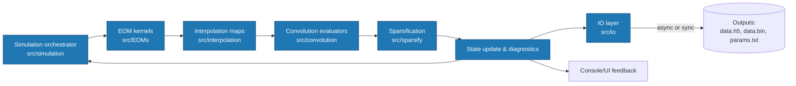

#  Architecture

The code mirrors physics operations:

- EOMs (`include/EOMs/`): RK54 (adaptive) with auto-switch to SSPRK104; optional SERK2 trials post-sparsification.
- Interpolation (`include/interpolation/`): sparse 2D interpolation kernels and index maps.
- Convolution (`include/convolution/`): memory-kernel evaluations.
- Sparsification (`include/sparsify/`): maintains sublinear memory/compute with error control.
- Simulation (`include/simulation/`): orchestration, checkpoints, and async I/O.
- Core/Math/IO/Version: utilities, numeric primitives, I/O (HDF5 runtime), version policy.

## System flow

## I/O layer (modular, runtime‑optional HDF5)

The monolithic save path was split into focused modules:
- `io_save_hdf5.*`: write `data.h5` when HDF5 is available. Uses a runtime loader by default and falls back to the compile‑time path if enabled.
- `io_save_binary.*`: binary fallback (`data.bin`) identical in content layout to the HDF5 datasets.
- `io_save_params.*`: `params.txt` with CLI, grid provenance (including `alpha`/`delta` if used), version/build info, runtime stats.
- `io_save_compressed.*`: compact snapshots (`QK_compressed`, `QR_compressed`, `t1_compressed.txt`).
- `io_save_driver.*`: orchestrates sync/async export and progress signaling.

Console/TUI behavior:
- HDF5 libraries are loaded at runtime (dlopen); the program prints which libraries were found. If unavailable or a write error occurs, saving continues via `data.bin`.
- Save progress is staged: main file [0.10..0.50], params [0.50..0.65], histories [0.65..0.80], compressed [0.80..0.90], then DONE.

Accuracy knobs:

- Grid length L (512/1024/2048): convergence in observables vs. runtime.
- Integrator tolerance `-e`, min step `-d`: trade accuracy vs. cost.
- Sparsification mode: aggressive vs. conservative.

GPU/CPU paths are interchangeable; ensure convergence checks are done on your platform of choice.
