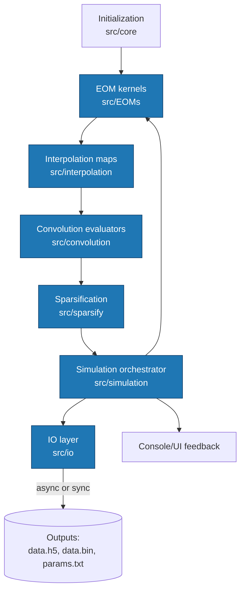

#  Architecture

**Audience:** readers who want a map of the codebase and module responsibilities.

The code mirrors physics operations:

- EOMs (`include/EOMs/`): RK54 (adaptive) with auto-switch to SSPRK104; optional SERK2 trials post-sparsification.
- Interpolation (`include/interpolation/`): sparse 2D interpolation kernels and index maps.
- Convolution (`include/convolution/`): memory-kernel evaluations.
- Sparsification (`include/sparsify/`): maintains sublinear memory/compute with error control.
- Simulation (`include/simulation/`): orchestration, checkpoints, and async I/O.
- Core/Math/IO/Version: utilities, numeric primitives, I/O (HDF5 runtime), version policy.

## System flow

```mermaid
flowchart TD
  init[Initialization<br/>src/core] --> eoms[EOM kernels<br/>src/EOMs]
  eoms --> interp[Interpolation maps<br/>src/interpolation]
  interp --> conv[Convolution evaluators<br/>src/convolution]
  conv --> sparsify[Sparsification<br/>src/sparsify]
  sparsify --> sim[Simulation orchestrator<br/>src/simulation] 
  sim --> eoms
  sim --> io[IO layer<br/>src/io]
  io -->|async or sync| storage[(Outputs:<br/>data.h5, data.bin, params.txt)]
  sim --> console[Console/UI feedback]

  classDef module fill:#1f77b4,stroke:#0d3b66,color:#fff
  sim:::module
  eoms:::module
  interp:::module
  conv:::module
  sparsify:::module
  io:::module
```

## I/O layer (modular, runtime‑optional HDF5)

The monolithic save path was split into focused modules:
- `io_save_hdf5.*`: write `data.h5` when HDF5 is available. Uses a runtime loader by default and falls back to the compile‑time path if enabled.  
- `io_save_binary.*`: binary fallback (`data.bin`) identical in content layout to the HDF5 datasets.  
- `io_save_params.*`: `params.txt` with CLI, grid provenance (including `alpha`/`delta` if used), version/build info, runtime stats.  
- `io_save_compressed.*`: compact snapshots (`QK_compressed`, `QR_compressed`, `t1_compressed.txt`).  
- `io_save_driver.*`: orchestrates sync/async export and progress signaling.

### Compressed snapshots: file formats (`QK_compressed`, `QR_compressed`, `t1_compressed.txt`)

The compressed snapshots are designed for quickly plotting/inspecting the final state
without loading the full history (HDF5/binary) data.

They consist of two binary matrices and one text file:

- `QK_compressed`: a dense $L\times L$ matrix (double precision). In the current codebase this is saved from `QKB1int`.
- `QR_compressed`: a dense $L\times L$ matrix (double precision). In the current codebase this is saved from `QRB1int`.
- `t1_compressed.txt`: a length-$L$ vector of time points.

#### Binary layout

Both `QK_compressed` and `QR_compressed` share the same binary layout:

1. `rows`: `size_t` (native endian)
2. `cols`: `size_t` (native endian)
3. `rows*cols` values of type `double` (native endian)

Notes:

- Because the header uses `size_t`, the header is typically 16 bytes on 64-bit systems, but can be 8 bytes on 32-bit systems.
- Most modern machines are little-endian; if you read these files on a different architecture you must account for endianness.

#### Meaning of `t1_compressed.txt` and the $(t_1,\theta)$ coordinates

The text file `t1_compressed.txt` stores the values

$$
t_1[i] = t_{\mathrm{last}}\,\theta[i],\qquad i=0,\dots,L-1,
$$

where $t_{\mathrm{last}}$ is the final simulated time (the last entry in the integrator's `t1grid`) and
$\theta=t_2/t_1\in(0,1]$ is the dimensionless ratio used by the internal compressed representation.

In other words, if you load:

$$
t_1\_\text{points} = \texttt{loadtxt}(\texttt{t1\_compressed.txt}),\qquad t_{\mathrm{last}} = t_1\_\text{points}[-1],\qquad \theta\_\text{points} = t_1\_\text{points}/t_{\mathrm{last}},
$$

then the compressed matrices are interpreted as samples on the grid

$$
(t_1,\theta) \in (\theta\_\text{points}\,t_{\mathrm{last}})\times(\theta\_\text{points}).
$$

This is why typical post-processing evaluates waiting-time slices via

$$
t_1 = t_w+\tau,\qquad \theta = \frac{t_w}{t_w+\tau}.
$$

See also: `scripts/plot_correlation.py` and the “Reading outputs” tutorial.

### Console/TUI behavior:
- HDF5 libraries are loaded at runtime (dlopen); the program prints which libraries were found. If unavailable or a write error occurs, saving continues via `data.bin`.  
- Save progress is staged: main file [0.10..0.50], params [0.50..0.65], histories [0.65..0.80], compressed [0.80..0.90], then DONE.  

### Accuracy knobs:

- Grid length L (512/1024/2048): convergence in observables vs. runtime.  
- Integrator error tolerance ε and minimum step: trade accuracy vs. cost.  
- Sparsification mode: aggressive vs. conservative.

GPU/CPU paths are interchangeable; ensure convergence checks are done on your platform of choice.
