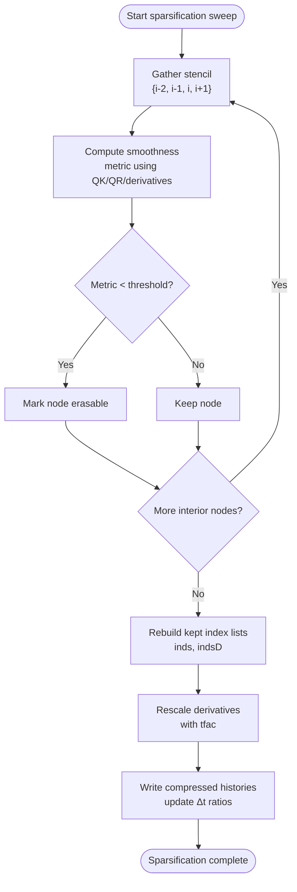

#  Sparsification

Sparsification preserves asymptotic efficiency by pruning history with controlled error. The pruning criterion and reconstruction exactly match the implementation in `src/sparsify/`.

What is pruned: interior time‑nodes of the 1D history grid `t1grid` along $t_1$. Endpoints are always kept.

Pruning criterion (CPU and GPU): for each interior i ≥ 2 with i + 1 < N, compute a smoothness measure using QK, QR and their t‑derivatives on the stencil {i−2, i−1, i, i+1} with non‑uniform gaps Δt:

- Let $t_{\text{left}} = t[i-2],\; t_{\text{mid}} = t[i]$; define $\Delta_1 = t[i-1] - t_{\text{left}},\; \Delta_2 = t_{\text{mid}} - t_{\text{left}},\; \Delta_3 = t[i+1] - t_{\text{mid}}$ and scale $s = \Delta_2/12$.
- For each component $j = 1\dots \text{len}$, accumulate

	$\displaystyle s\,\big\lvert 2\,(QK[i]-QK[i-2]) - \Delta_2\,\big(\tfrac{\mathrm d QK[i-1]}{\Delta_1} + \tfrac{\mathrm d QK[i+1]}{\Delta_3}\big) \big\rvert$

	$\displaystyle +\; s\,\big\lvert 2\,(QR[i]-QR[i-2]) - \Delta_2\,\big(\tfrac{\mathrm d QR[i-1]}{\Delta_1} + \tfrac{\mathrm d QR[i+1]}{\Delta_3}\big) \big\rvert.$

- Optionally (CPU path), add the same form for the scalar $r$:

	$\displaystyle s\,\big\lvert 2\,(r[i]-r[i-2]) - \Delta_2\,\big(\tfrac{\mathrm d r[i-1]}{\Delta_1} + \tfrac{\mathrm d r[i+1]}{\Delta_3}\big) \big\rvert.$
- If the total is below the threshold, node i is erasable; otherwise it is kept.

## Index reconstruction and derivative scaling

- Build the kept index list `inds` including $0$ and $N-1$.
- Build `indsD` by shifting interior kept indices by $+1$ for derivative‑anchored data; set `indsD[0]=0`.
- Compute `tfac` per kept chunk: `tfac[0]=1`, and for `i > 0`

$$
\displaystyle \text{tfac}[i] = \frac{t\big[\text{inds}[i]\big] - t\big[\text{inds}[i-1]\big]}{t\big[\text{indsD}[i]\big] - t\big[\text{indsD}[i]-1\big]}.
$$
- Gather arrays with these indices:
	- QK, QR, r use `inds`.
	- dQK, dQR, dr use `indsD` and are multiplied by tfac to preserve derivative consistency under grid compression.
- Compress `t1grid` with `inds` and recompute $\Delta t$ and `delta_t_ratio` as $\Delta t_i/\Delta t_{i-1}$ for $i \ge 2$.

## Cadence and modes

- The GPU implementation evaluates flags at even indices for efficiency; CPU checks all interior indices.
- Aggressive vs conservative modes only change the threshold value and sweep cadence; the mechanism is identical.
- After sparsification, the code may try SERK2 briefly; disable via `--serk2=false` if desired.

## Choosing a threshold

- Start from the default (tuned for len and ε) and validate on short runs by comparing C and R slices and derived observables (energy, gFDR/FDT diagnostics) with sparsification off. Increase threshold for more compression; decrease for more accuracy.

Implementation references: `include/sparsify/sparsify_utils.hpp`, `src/sparsify/sparsify_utils.cpp` (CPU), `src/sparsify/sparsify_utils.cu` (GPU). Post‑prune, interpolation is re‑initialized automatically by downstream calls.

