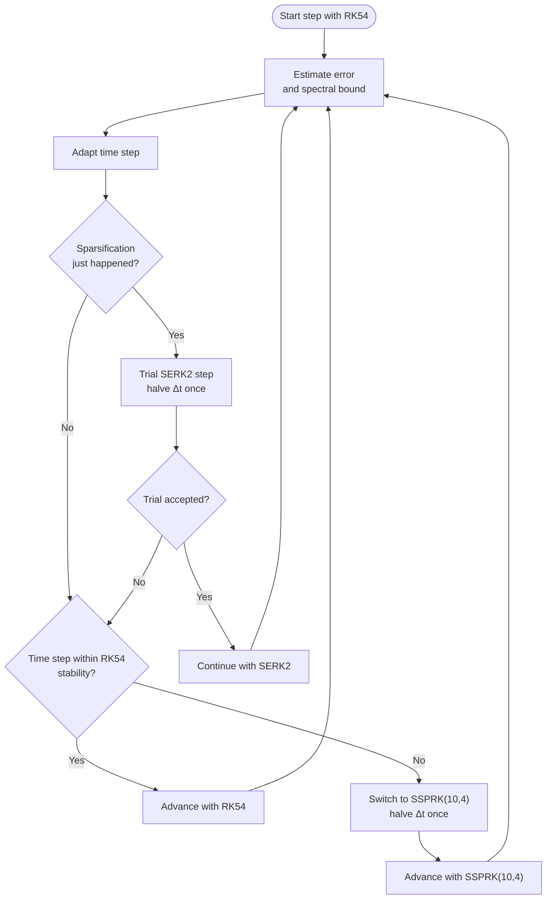

#  Time integration

**Audience:** readers who want the solver choices and stability/error-control rationale.

Default strategy: adaptive Dormand–Prince RK54. When the adaptive step approaches the RK54 stability limit, the solver switches to SSPRK(10,4) for stability at larger steps. After each sparsification event, the code may attempt SERK2; this trial can be disabled via CLI.

## Summary

- RK54 = Dormand–Prince (adaptive default): embedded error estimate controls local error and proposes Δt.
- SSPRK(10,4) (auto‑switch): engaged when RK54 reaches its absolute‑stability bound to continue with stable steps at late times.
- SERK2 (optional): attempted after sparsification to exploit extended stability; can be disabled via a runtime configuration option.

## Error and stability controls

- Error bound on each step applies to the 1‑norm of C and R:

$$
\|C(t,\, \phi_k\, t)\|_1 + \|R(t,\, \phi_k\, t)\|_1 \leq \varepsilon.
$$

- Dormand–Prince stability along the negative real axis extends to about $-3.307$. With an upper bound on the Jacobian spectral radius $\lambda_{\max} \lesssim 4\,\Sigma''(1)$, the code switches to SSPRK$(10,4)$ once $\lambda_{\max}\,\Delta t > 3.0$. On switch, $\Delta t$ is halved once to account for the lower order, then adapted normally.
- Step‑size controller increases $\Delta t$ slightly when below target error and reduces it when above.

## Where to configure

Most users should treat these as *configuration knobs* rather than part of the conceptual model. For the consolidated runtime configuration (flags + defaults), see [Usage](../usage.md).

- Error tolerance (ε) for the embedded estimate.
- Minimum time step to avoid over‑refinement near initial transients.
- Caps on total iterations and/or physical time.
- Whether SERK2 trials are enabled after sparsification.

## Practice

- Check that key observables (C, R) at latest times are independent of the configured error tolerance.
- If concerned about stability, disable the lower order method SERK2 at the risk of potentially slightly lower performance at late times.

Implementation details: see [`include/EOMs/`](https://github.com/DMFT-evolution/DMFE/tree/main/include/EOMs) and [`src/EOMs/`](https://github.com/DMFT-evolution/DMFE/tree/main/src/EOMs) (RK54 Dormand–Prince, SSPRK(10,4), SERK2 kernels and selection logic).
