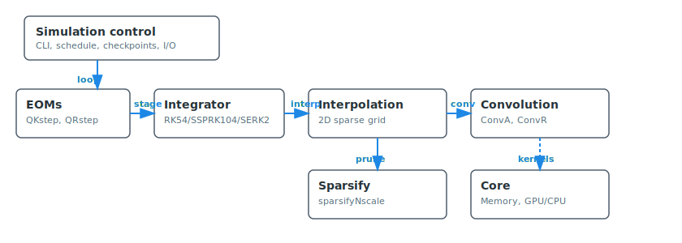

<div style="display:flex;align-items:center;gap:16px;margin-bottom:8px;">
	
	<h1 style="margin:0;">DMFE: Dynamical Mean-Field Evolution Toolkit</h1>
</div>

<p style="margin-top:0;color:#455a64;">
	Rigorous time-evolution of non-stationary DMFT equations for glassy and related systems.
	Expert-focused, with validated CPU and accelerated GPU paths.
	Designed for reproducible, high-accuracy studies of aging observables and quenches.
</p>

## Problem setting (DMFT, aging, quench)

We evolve correlation and response functions after a quench under closed dynamical equations of the form

$$
\partial_t C(t,t') = \mathcal{F}[C,R](t,t')\,,\qquad
\partial_t R(t,t') = \mathcal{G}[C,R](t,t')\,,\quad t\ge t'\,.
$$

The solver implements a numerical renormalization scheme with two-dimensional interpolation, reducing the asymptotic cost from cubic to sublinear in simulated time while controlling accuracy relevant to aging observables.

## Method at a glance

- Two-dimensional sparse interpolation for history terms
- Adaptive RK54 as default; auto-switch to SSPRK104 at stability limit; optional SERK2 trials after sparsification
- GPU kernels with portable CPU fallback
- Asynchronous I/O; resume runs and version-compat checks

Relevant modules: core, EOMs, interpolation, convolution, sparsify, simulation, io.

<figure>
	
	<figcaption>Method pipeline: quench to observables with CPU/GPU execution paths.</figcaption>
</figure>

## Quickstart (expert)

- Build Release:

```bash
./build.sh
```

- Short quench on L=512 grid:

```bash
./RG-Evo -L 512 -l 0.5 -m 1e4 -D false
```

- Outputs: HDF5 `data.h5` when available (datasets: `QKv`, `QRv`, `dQKv`, `dQRv`, `t1grid`, `rvec`, `drvec`) with attributes for parameters and time; otherwise binary with text summaries.

## Where to go next

- Installation notes: install.md (toolchain/CUDA arch selection)
- Usage and flags: usage.md (physics meanings and recommended ranges)
- Equations and observables: concepts/eoms-and-observables.md
- Architecture and accuracy controls: concepts/*
- API reference (headers): reference/api/

## Architecture overview

<figure>
	
	<figcaption>High-level module interactions and data flow.</figcaption>
</figure>

## Logo exploration (preview)

Below are two simplified alternatives that emphasize the theta-grid/causal triangle while keeping a clean, recognizable silhouette. These are previews; the configured site logo remains unchanged.

<div style="display:flex;gap:24px;align-items:center;flex-wrap:wrap;">
	<figure style="margin:0;">
		
		<figcaption style="text-align:center;color:#607d8b;">Option A: grid background + sparse nodes</figcaption>
	</figure>
	<figure style="margin:0;">
		
		<figcaption style="text-align:center;color:#607d8b;">Option B: minimalist triangle + theta arcs</figcaption>
	</figure>
</div>
