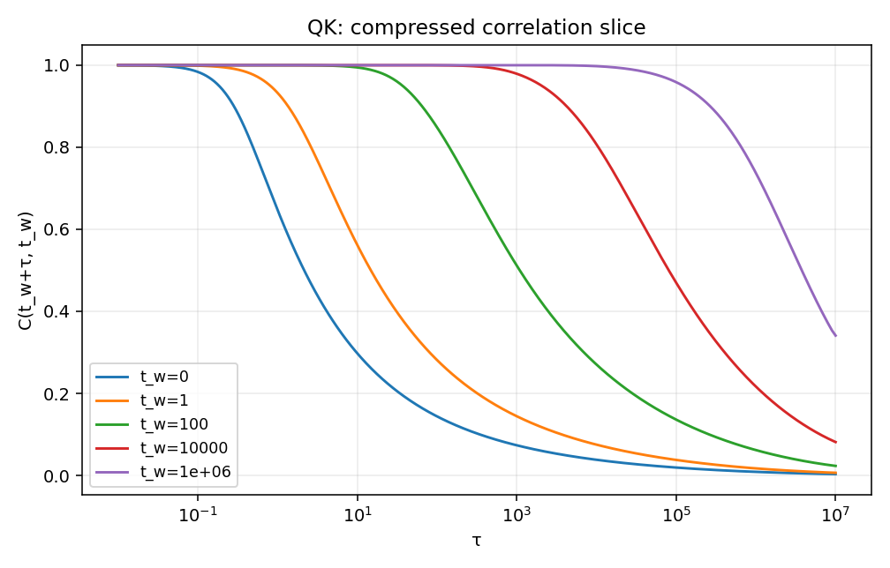

#  Tutorial: Reading outputs (and trusting them)

DYNAMITE writes a **self-contained output directory** for each run. This directory is designed to be both:

- easy to inspect quickly (text summaries), and
- reproducible / restartable (versioned params + full state in HDF5 or binary).

## What files to expect

Depending on the build and available libraries you’ll get **either**:

- `data.h5` (preferred when HDF5 is available), **or**
- `data.bin` (binary fallback, always available),

and additionally:

- `params.txt` (parameters + version/build/provenance)
- text summaries such as `energy.txt`, `correlation.txt`, `rvec.txt`, `qk0.txt` (exact set may depend on run options)

If you build without HDF5 support (or runtime HDF5 loading fails), the code automatically falls back to `data.bin` and still produces the same core state.

## Quick inspection (HDF5)

If `data.h5` exists, you can inspect structure with common tools:

```bash
h5ls -r data.h5
h5dump -n data.h5
```

Core datasets written by DYNAMITE include:

- `QKv`, `QRv`: correlation/response samples on the internal (non-equidistant) time-ratio grid
- `dQKv`, `dQRv`: time derivatives (used by integrators / diagnostics)
- `t1grid`: the (adaptive) time nodes $t$ used during integration
- `rvec`, `drvec`: diagonal/reduced observables tracked during the run

Tip: `params.txt` is the fastest way to see **exactly** what the run did (grid size, tolerances, CPU/GPU mode, etc.).

## Text summaries (fast plotting)

For most physics-facing diagnostics you don’t need to parse the full 2D state immediately. Start with the text files:

- `energy.txt`: time series of the energy (used for stability checks and aging analysis)
- `correlation.txt`: commonly used slices/diagnostics of $C$ (format documented in-file; see file header)
- `rvec.txt`: reduced/diagonal observables (format documented in-file)

These are intended for quick plotting and sanity checks.

## Binary fallback (`data.bin`) is fully supported

`data.bin` is not a “degraded mode”: it’s the supported non-HDF5 carrier for the full simulation state.

- Save path: when HDF5 is unavailable (or fails), the program writes `data.bin` instead.
- Load/resume path: binaries can be loaded to resume trajectories if compatible with the current build/version policy.

Implementation references (for developers): see declarations in [`include/io/io_utils.hpp`](https://github.com/DMFT-evolution/DMFE/blob/main/include/io/io_utils.hpp) and implementations under [`src/io/`](https://github.com/DMFT-evolution/DMFE/tree/main/src/io) (binary save/load, plus optional HDF5 writers).

## Reproducibility & provenance (how to trust a run)

Each output directory includes the information needed to reproduce a run:

1) **Exact code identity**

Open `params.txt` and record:
- `code_version`, `git_hash`, `git_branch`, `git_tag`, `git_dirty`  
- compiler/CUDA versions and build timestamp

2) **Exact runtime configuration**

In `params.txt` you’ll also find:
- the full stored command line  
- physical parameters ($p$, $p2$, $\lambda$, $T_0$, $\Gamma$)  
- numerical parameters (grid `len`, tolerances, sparsification settings, integrator toggles)

3) **Grid provenance**

The run uses precomputed grid packages under `Grid_data/<L>/`. The grid generator writes metadata to:

- `Grid_data/<L>/grid_params.txt`

and DYNAMITE mirrors key entries into `params.txt` (prefixed with `grid_...`). This makes it easy to confirm that a run used the intended grid package even after you move/copy the output directory.

Practical recommendation: keep `params.txt` alongside `data.h5`/`data.bin` when archiving or sharing results.

## Sanity checks before trusting long runs

These checks are fast and catch most common issues:

- **CPU vs GPU short-time agreement**: run a short trajectory with `--gpu false` and compare key summaries (e.g. `energy.txt`).
- **Grid convergence**: compare L=512 vs 1024 (and 2048 if needed) at fixed parameters.
- **Tolerance sensitivity**: tighten the integrator tolerance `-e` and confirm observables don’t shift materially.
- **Sparsification sensitivity (spot check)**: run briefly with `--sparsify-sweeps 0` and confirm agreement in your observables of interest.
- **Resume discipline**: when resuming, confirm `params.txt` compatibility and keep the original directory intact.

## Next: plotting scripts

We provide small Python helpers under `scripts/` to quickly plot standard summaries (energy vs time, etc.). See:

- `scripts/plot_energy_threshold_gap.py` (log-log plot of $E(t) - E_{\mathrm{th}}$)
- `scripts/plot_correlation.py`

These are intentionally lightweight and can be adapted to create publication figures (e.g. $C(t_w+\tau, t_w)$ at multiple waiting times, and response-vs-correlation parametric plots).

Dependencies: these scripts use `numpy` and `matplotlib`.

### Threshold-energy gap plot ($E(t) - E_{\mathrm{th}}$)

If your output directory contains `energy.txt` and `params.txt`, you can generate the standard log-log plot of the *gap to threshold energy*:

$$
E(t) - E_{\mathrm{th}}
$$

where $E(t)$ is read from `energy.txt`, and $E_{\mathrm{th}}$ is computed from the parameters `lambda`, `p`, and `q` (with `q` usually stored as `p2` in `params.txt`).

The threshold energy depends on the final temperature parameter `Gamma`:

- If `Gamma = 0` (zero-temperature limit), define

	$$
	f_{\lambda}(x)=\lambda x^p+(1-\lambda)x^q
	$$

	and compute

	$$
	E_{\mathrm{th}}=\sqrt{f_{\lambda}''(1)}\left(\frac{f_{\lambda}(1)}{f_{\lambda}''(1)}-\frac{f_{\lambda}'(1)}{f_{\lambda}''(1)}-\frac{f_{\lambda}(1)}{f_{\lambda}'(1)}\right).
	$$

- If `Gamma > 0` (finite final temperature), first solve for $q_1\in(0,1)$ from

	$$
	\frac{1}{(1-q_1)^2}-\frac{f_{\lambda}''(q_1)}{\Gamma^2}=0,
	$$

	and then compute

	$$
	E_{\mathrm{th}}=\frac{-f_{\lambda}(1)+f_{\lambda}(q_1)\left(\frac{1}{q_1}+\frac{\Gamma^2}{(q_1-1)\,f_{\lambda}'(q_1)}\right)}{\Gamma}.
	$$

Typical usage:

```bash
python3 scripts/plot_energy_threshold_gap.py /path/to/output/dir --out eth_gap.png
```

Notes:

- The plot is log-log, so it requires $t>0$ and $E(t)-E_{\mathrm{th}}>0$. If early times lead to non-positive values, you can drop those points with:

```bash
python3 scripts/plot_energy_threshold_gap.py /path/to/output/dir --skip-nonpositive --out eth_gap.png
```

### Correlation slice plot ($C(t_w+\tau, t_w)$) from compressed outputs

If your output directory contains the compressed snapshot files

- `QK_compressed`
- `QR_compressed`
- `t1_compressed.txt`

you can quickly generate waiting-time slices of the correlation (or response)
without reading the full history files. Here, we demonstrate this using a 
*2D spline interpolation* of the compressed matrix.

#### Coordinates (important)

The compressed snapshot uses the variables $(t_1,\theta)$.
For the on-disk file formats and the precise meaning of these coordinates, see
[Architecture → Compressed snapshots](../concepts/architecture.md#compressed-snapshots-file-formats-qk_compressed-qr_compressed-t1_compressedtxt).

To evaluate a physical waiting-time slice, the script queries an interpolant at

$$
t_1 = t_w+\tau,\qquad \theta = \frac{t_w}{t_w+\tau},
$$

#### Typical usage

Below is an example waiting-time slice plot produced from a simulation run (saved as `docs/assets/Cwaiting.png`):



An end-to-end workflow looks like:

```bash
# 1) Run DYNAMITE (example parameters)
./RG-Evo -m <max_steps> -D <true|false> -p <p> -q <q> -l <lambda> -L <L>

# 2) Plot C(t_w+τ, t_w) using the compressed snapshot written into the output directory
python3 scripts/plot_correlation.py /path/to/output/dir --out Cwaiting.png
```

Plot of the response function from `QR_compressed` instead:

```bash
python3 scripts/plot_correlation.py /path/to/output/dir --which QR --out Rwaiting.png
```

Change the waiting times (comma-separated list or a compact power-range like `100^0..3`):

```bash
python3 scripts/plot_correlation.py /path/to/output/dir --tw "0,1,10,100" --out corr.png
```

Notes:

- The script uses a spline interpolator (SciPy), however linear interpolations are often good enough.
- The x-axis is logarithmic by default (matching Mathematica's `LogLinearPlot`). Use `--linear-x` to switch to a linear x-axis.
- Axis labels use robust Unicode text by default (no LaTeX dependency). If you want full LaTeX rendering and have a working LaTeX install, pass `--usetex`.
- Use `--tau-min/--tau-max` and `--n-tau` to control the plotted interval and resolution.
